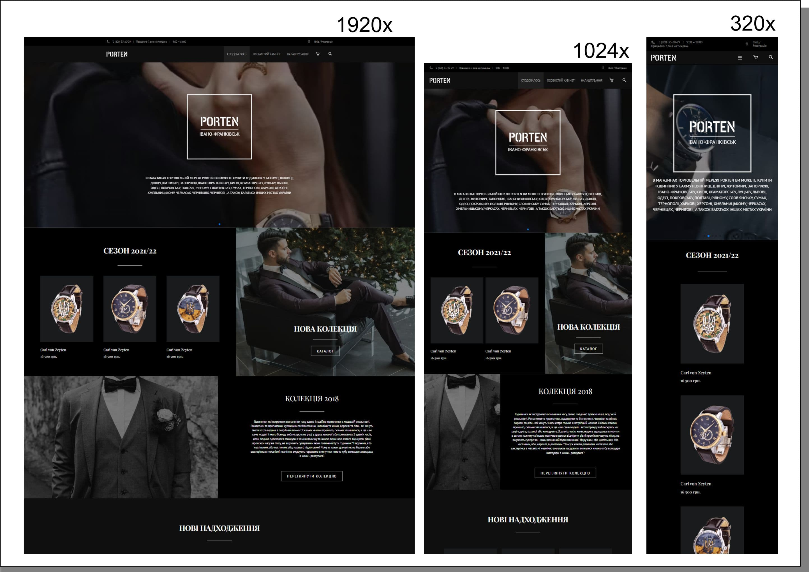

# Start page of the online watch store

## Frontend

Projects were created with the following width:

- Mobile version: 320 pixels.
- Desktop: 1920 pixels.

### Links

- Solution URL: (https://github.com/Papa-Pechatnik/833_Test_Landing)
- Live Site URL: (https://landing-porten-shop.netlify.app/)

### Built with

- Semantic HTML5 markup
- CSS custom properties
- Flexbox
- CSS Grid
- Desktop & mobile workflow

### What I learned

JavaScript library for creating responsive and customizable sliders or carousels on web pages.

### Useful resources

- [Example resource 1](https://swiperjs.com/) -  really liked this pattern and will use it going forward.

## Author

- Website - [Add your name here](https://www.your-site.com)

